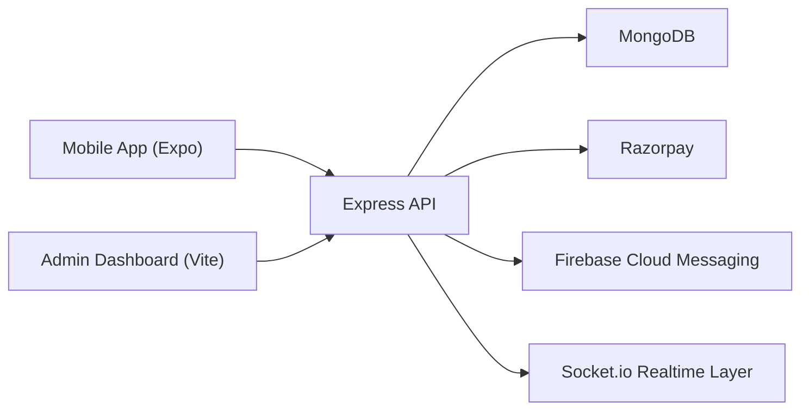

# Servify

Tap once. Get your task done.

Servify is a full-stack on-demand service booking marketplace for customers, providers, and admins. The platform supports local home services such as plumbers, electricians, cleaning specialists, repair technicians, salon experts, and more.

## Overview

- `backend`: Express, MongoDB, JWT, Razorpay, FCM, Socket.io, Zod validation
- `mobile-app`: Expo React Native app with Zustand, Axios, push notification registration, booking flow
- `admin-dashboard`: React + Vite admin panel

## Architecture



## Tech Stack

- Mobile: React Native, Expo, Zustand, Axios, React Navigation
- Backend: Node.js, Express, Mongoose, Zod, JWT, Multer, Winston, Socket.io
- Database: MongoDB
- Payments: Razorpay
- Notifications: Firebase Cloud Messaging
- Admin: React, Vite
- Testing: Jest, Supertest, MongoDB Memory Server
- DevOps: Docker, GitHub Actions, Expo EAS

## Monorepo Structure

```text
/backend
/mobile-app
/admin-dashboard
```

## Backend Features

- Role-based auth for customers, providers, and admins
- Access token and refresh token flow
- OTP generation and verification hooks
- Provider pagination and filtering
- Centralized validation and error handling
- Rate limiting, Helmet, sanitization, and upload endpoints
- Razorpay order creation, verification, failure handling, and refund support
- FCM notification service for booking and payment events
- Seed script for categories, services, providers, and admin user

## API Summary

### Auth

- `POST /api/auth/register`
- `POST /api/auth/login`
- `POST /api/auth/forgot-password`
- `POST /api/auth/reset-password`
- `POST /api/auth/refresh-token`
- `POST /api/auth/logout`
- `POST /api/auth/send-otp`
- `POST /api/auth/verify-otp`
- `POST /api/auth/device-token`

### Services and Providers

- `GET /api/categories`
- `GET /api/services`
- `POST /api/services`
- `GET /api/providers`
- `GET /api/providers/:id`
- `POST /api/providers`
- `PUT /api/providers/:id`

### Bookings and Reviews

- `POST /api/bookings`
- `GET /api/bookings/user`
- `GET /api/bookings/provider`
- `PUT /api/bookings/:id/status`
- `POST /api/reviews`
- `GET /api/reviews/provider/:id`

### Payments and Notifications

- `POST /api/payment/create-order`
- `POST /api/payment/verify`
- `POST /api/payment/failure`
- `POST /api/payment/refund`
- `POST /api/notifications/send`

## Setup

1. Install dependencies:

```bash
npm install --workspaces
```

2. Create environment files:

- `backend/.env`
- `mobile-app/.env`
- `admin-dashboard/.env`

3. Start the backend:

```bash
npm run dev:backend
```

4. Start the mobile app:

```bash
npm run dev:mobile
```

5. Start the admin dashboard:

```bash
npm run dev:admin
```

## Environment Variables

Important backend variables:

- `PORT`
- `MONGODB_URI`
- `JWT_SECRET`
- `JWT_REFRESH_SECRET`
- `RAZORPAY_KEY_ID`
- `RAZORPAY_KEY_SECRET`
- `FCM_PROJECT_ID`
- `FCM_CLIENT_EMAIL`
- `FCM_PRIVATE_KEY`
- `CORS_ORIGINS`

Mobile variables:

- `EXPO_PUBLIC_API_URL`
- `EXPO_PUBLIC_GOOGLE_MAPS_API_KEY`
- `EXPO_PUBLIC_RAZORPAY_KEY_ID`

## Seeding Data

Run:

```bash
npm --workspace backend run seed
```

This creates:

- default categories
- sample services
- sample providers
- an admin account

## Testing

Run backend tests:

```bash
npm run test:backend
```

Covered scenarios:

- authentication
- provider listing
- booking creation
- payment verification

## Deployment

### Backend

- Dockerized with [backend/Dockerfile](C:/Users/ashut/OneDrive/Desktop/Servify/backend/Dockerfile)
- Docker VPS steps:
  1. Copy the repo to your server
  2. Create `backend/.env`
  3. Run `docker compose up --build -d`
  4. Verify `http://your-server:5000/health`

### Mobile

- Expo EAS config in [mobile-app/eas.json](C:/Users/ashut/OneDrive/Desktop/Servify/mobile-app/eas.json)
- App metadata in [mobile-app/app.json](C:/Users/ashut/OneDrive/Desktop/Servify/mobile-app/app.json)
- Expo EAS steps:
  1. Install EAS CLI
  2. Configure Expo credentials
  3. Run `eas build -p android --profile production`
  4. Test payment and push notification flows on device

### Admin Dashboard

- Production build:

```bash
npm run build:admin
```

- Vercel steps:
  1. Import the repo in Vercel
  2. Set the root directory to `admin-dashboard`
  3. Add `VITE_API_URL`
  4. Deploy and log in through the admin login page

## CI/CD

GitHub Actions workflow:

- installs dependencies
- runs backend tests
- checks backend entrypoint
- builds the admin dashboard

Workflow file:

- [.github/workflows/ci.yml](C:/Users/ashut/OneDrive/Desktop/Servify/.github/workflows/ci.yml)

## Notes

- Razorpay mobile checkout still requires native SDK wiring in an Expo development build for full production payments.
- FCM server integration is complete on the backend; client delivery depends on valid Firebase and Expo notification credentials.
- The current mobile app now consumes live APIs for auth, category browsing, provider discovery, booking creation, review submission, and provider booking actions.
- Final pre-release checklist is in [RELEASE_CHECKLIST.md](C:/Users/ashut/OneDrive/Desktop/Servify/RELEASE_CHECKLIST.md).
